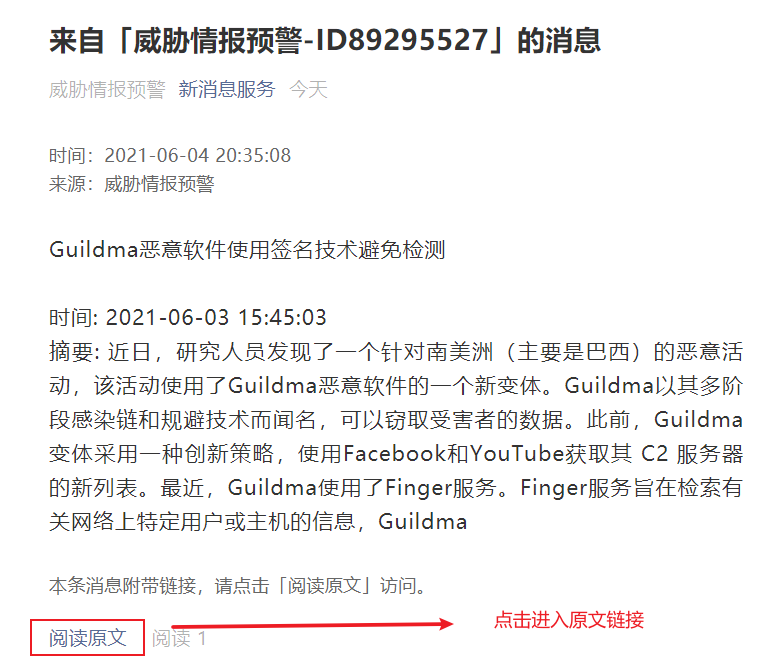

# threaten-push
## 项目说明

漏洞频发的时代，及时获取到漏洞信息是非常有必要的；本项目爬取各大漏洞情报来源（包括360，阿里，腾讯，安恒等漏洞来源）并及时推送到微信

## 脚本架构

```
│   README.md
├───threatpy
│   │   alithreaten.py
│   │   cert360threaten.py
│   │   config.py
│   │   dasthreaten.py
│   │   init_time.py
│   │   txthreaten.py
│   │   __init__.py
│   │   start.sh        # 设置定时运行的脚本
└───time
        alithreattime.txt
        cert360time.txt
        dasthreattime.txt
        txthreattime.txt
```

## 运行效果




## 

## 部署方法

运行环境：Linux，python3+


```
一、下载包
> python3 -m pip install requests
> python3 -m pip install lxml

二、初始化时间
设置当前时间
> python3 init_time.py

三、设置自己的APP_TOKEN和微信uids
> vim config.py

# 设置自己申请的apptoken
appToken = 'xxx'
# 设置发送的wx id
uids = ['xxx']
申请方法： https://wxpusher.zjiecode.com/docs/#/

四、设置定时计划
> crontab -e
添加 0 * * * * sh xx/xx/xx/start.sh (start.sh的绝对路径)  # 可以自定义多久运行一次
```

## 目前的情报来源

- 360

- 阿里云

- 腾讯云

- 安恒

## 添加其他情报来源

